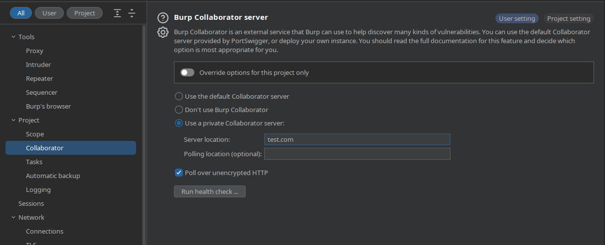
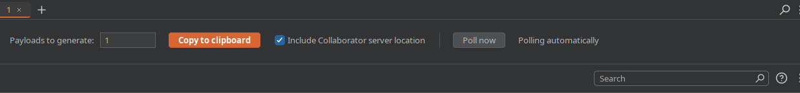

<h1 align="center">
collabpoller
</h1>
<h4 align="center">A tool to use your Collaborator Server without Burp</h4>

----

One day you may be constrained to only having an organizations [Burp Collaborator](https://portswigger.net/burp/documentation/collaborator#:~:text=Burp%20Collaborator%20is%20a%20network,Cause%20detectable%20time%20delays.) for testing callbacks or out of band requests. This can be an issue if you want to integrate out of band with your own scripts or don't have Burp Professional. 

<p align="center">
  <a href="#Capture-biids">Capture Biids</a> •
  <a href="#Config Setup">Config</a> •
  <a href="#Install">Install</a> •
  <a href="#Running-CLI">Running CLI </a> •
  <a href="#Using-in-your-own-scripts">Using in a script</a> •

----

## Setup Overview 

The setup requires Burp Professional or Enterprise but can be performed with a trial or with assistance of a coworker or friend.

From [Persistent Access to Burp Suite Sessions A Simple Guide](https://www.onsecurity.io/blog/persistent-access-to-burp-suite-sessions-step-by-step-guide/):

* To maintain a simple, stateful Collaborator implementation, Collaborator subdomains are generated using a key derivation function based on a secret key. This secret key is generated by the Collaborator client as soon as you open it and it’s destroyed as soon as you close it. 

* When polling for interactions, Collaborator’s server then regenerates the list of Collaborator domains from the secret key, and returns the interactions it has recorded against those subdomains. This opens the possibility of capturing a Collaborator secret key and using it to poll for interactions made against links generated from that secret key.

## Capture biids

Polling is accomplished with a generated biid. To get a biid make sure to configure Burp Collaborator to use a private domain and set the polling to HTTP only.   



Next start tcpdump with the `<collab_domain>`

```
sudo tcpdump -i ens160 dst polling.<collab_domain> and dst port 80
```
Go to the collaborator tab. 



Hit __Copy to clipboard__ several times and put the domains in a text file. After hit __Poll now__ and look at your packet capture to identify the bid value from the request to `/burpsuite?biid=`. URL decode the biid value and save it for the config. It should look something like below in your packet capture.  

```
20:07:09.588990 IP pd-sadcasdcrtlus475.36474 > 183.143.125.24.bc.com.http: Flags [P.], seq 0:381, ack 1, win 503, options [nop,nop,TS val 3984352604 ecr 4104849361], length 381: HTTP: GET /burpresults?biid=g1yw7YHsdfsf3xAdGgqUXwOgaYBR8WO%2bj08uy7Th0O0%3d HTTP/1.1
```
That should be enough for the config.  You can close and reopen Burp to capture additional biid or domain values.

## Config Setup 

* poll_interval - time to wait when running in poll mode to check for new requests
* subdomain - the domain URL to poll against 
* biids - this should be your biid and any generated ids 
* output - this is where to log raw JSON responses returned, blank won't log.  

```
{
    "poll_interval": 45,
    "subdomain": "mydomains.mycollab.com",
    "biids": {
        "pfZAtrpFwKG5wFILrKqimvzFZiFj2bVaRwWkrg4R//s=":["saawvasvdsadvd.mydomains.mycollab.com","saawsadfeasvdsadvd.mydomains.mycollab.com"],
        "IONqSYhK0yYhF0PZOGaPdPAHu4J8dRFZCiQsTxa8ld4=":["saaw4dsadd3.mydomains.mycollab.com","c3wc3fasdv3dy.mydomains.mycollab.com"]
    },
    "output":"logfile.txt"
}
```

## Install
```
git clone https://github.com/aringo/collabpoller.git
cd collabpoller
pip3 install .
```

## Running CLI  

### pull a domain from the config to test with
```
collabpoller --payload
Generated Payload: subdomain.yourcollab.com
```
### check the collaborator server once, right meow
```
collabpoller --check
```
### start checking for interactions on an interval
```
collabpoller --poll
Checking for requests every: 45 seconds
2024-05-25 21:12:37: polling
```

## Using in your own scripts
```
from collabpoller.poller import CollaboratorPoller

# Create an instance of CollaboratorPoller
poller = CollaboratorPoller()

# Generate a payload
payload = poller.gen_payload()
print(payload)

# Check for single interaction
poller.poll_all_biids()

# Start polling
poller.start_polling()
```

</p>

<table align="center">
    <tr>
        <td align="center">
            :exclamation:  **Disclaimer**
        </td>
    </tr>
    <tr>
        <td align="center">
            If you use Portswiggers servers you should purchase a license since those are for customer use
        </td>
    </tr>
</table>
